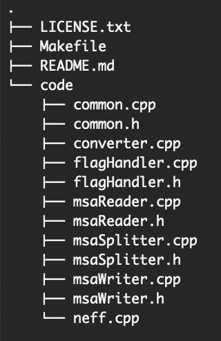

# NEFFy: NEFF Calculator and MSA File Converter
NEFFy is a versatile and efficient tool for bioinformatics research, offering advanced features for calculating NEFF (Normalized Effective Number of Sequences) for Multiple Sequence Alignments (MSA)s of any biological sequences, including protein, RNA, and DNA across various MSA formats. <br>
Additionally, NEFFy includes built-in support for format conversion, allowing users to seamlessly convert between different MSA formats.

## Table of Contents
- [Installation](#installation)
- [Tutorial](#tutorial)
  - [Project Outline](#project-outline)
  - [Usage](#usage)
    - [NEFF Computation](#1-neff-computation)
    - [MSA File Conversion](#2-msa-file-conversion)
- [Supported File Formats](#supported-file-formats)
- [Error Handling](#error-handling)
- [License](#license)

## Installation
To install the NEFFy tool, clone the repository and compile the code using a C++ compiler that supports C++17 or a newer version. You can use the provided [Makefile](Makefile) in the repository for this purpose. Navigate to the repository directory and enter the following command in the terminal:


```
make
```
If the `make` command is not available on your operating system, [here](https://maryam-haghani.github.io/NEFFy/help.html#make_installation) is how you can install it.

Once the compilation is complete, you can run the program via the command line. <br/>
This package is cross-platform and works on Linux, Windows, and macOS without requiring additional compilation. <br>

For more information on installing the executable, please refer to the [documentation](https://maryam-haghani.github.io/NEFFy/installation_guide.html#executable_install).

## Tutorial
This tutorial will first explain the structure of the NEFFy repository, followed by a guide on how to use it.

### Project Outline
The NEFFy repository is structured as follows:




### Usage
### 1. NEFF Computation

NEFF determines the effective number of homologous sequences within a Multiple Sequence Alignment (MSA). It accounts for sequence similarities and provides a measure of sequence diversity. <br/>
To calculate NEFF, use the `neff` program, provide an MSA file, and specify the desired flags.

#### Flags:
The code accepts the following command-line flags:
| Flag | Description | Required | Default Value | Example	| 
|------|-------------|----------|---------------|---------|
| `--file=<list of filenames>` | Input files (comma-separated, no spaces) containing multiple sequence alignments | Yes | N/A | `--file=my_alignment.fasta` |
| `--alphabet=<value>` | Alphabet of MSA <br /> __0__: Protein <br /> __1__: RNA <br /> __2__: DNA | No | 0 | `--alphabet=1` |
| `--check_validation=[true/false]` | Validate the input MSA file based on alphabet or not | No | false | `--check_validation=true` |
| `--threshold=<value>`	| Threshold value of considering two sequences similar (between 0 and 1) | No | 0.8 | `--threshold=0.7` |
| `--norm=<value>` | Normalization option for NEFF <br /> __0__: Normalize by the square root of sequence length <br /> __1__: Normalize by the sequence length <br /> __2__: No Normalization | No | 0 | `--norm=2` |
| `--omit_query_gaps=[true/false]` | Omit gap positions of query sequence from entire sequences for NEFF computation | No | true | `--omit_query_gaps=true`	|
| `--is_symmetric =true/false]` | Consider gaps in number of differences when computing sequence similarity cutoff (asymmetric) or not (symmetric)| No | true | `--is_symmetric=false`	|
| `--non_standard_option=<value>` | Options for handling non-standard letters of the specified alphabet <br /> __0__: Treat them the same as standard letters <br /> __1__: Consider them as gaps when computing similarity cutoff of sequences (only used in asymmetryc version) <br /> __2__: Consider them as gaps in computing similarity cutoff and checking position of match/mismatch | No | 0 | `--non_standard_option=1` |
| `--depth=<value>` | Depth of MSA to be considered in computation (starting from the first sequence) | No | inf (consider all sequences) | `--depth=10` <br />(if given value is greater than original depth, it considers the original depth) |
| `--gap_cutoff=<value>`| Threshold for considering a position as gappy and removing that (between 0 and 1) | No | 1 (no gappy position) | `--gap_cutoff=0.7` |
| `--pos_start=<value>`| Start position of each sequence to be considered in NEFF (inclusive) | No | 1 (the first position) | `--pos_start=10` |
| `--pos_end=<value>`| Last position of each sequence to be considered in NEFF (inclusive) | No | inf (consider all sequence) | `--pos_end=50` (if given value is greater than the length of the MSA sequences, consider length of sequences in the MSA)|
| `--only_weights=[true/false]` | Return only sequence weights, rather than the final NEFF | No | false | `--only_weights=true`    |
| `--mask_enabled=[true/false]` | Enable random sequence masking for NEFF calculation and return the masking with the highest NEFF | No | false | `--mask_enabled=true`    |
| `--mask_frac=<value>` | Fraction of sequences to be masked in each masking iteration | when _mask_enabled_=true | 0 | `--mask_frac=0.4`    |
| `--mask_count=<value>` | Number of masking iterations | when _mask_enabled_=true | 0 | `--mask_count=0`    |
| `--multimer_MSA=[true/false]` | Compute NEFF for paired MSA and individual monomer MSAs when MSA is in the form of multimer MSA | No | false | `--multimer_MSA=true`    |
| `--monomer_length=<list of values>` | Length of the monomers, used to obtain NEFF for paired MSA and individual monomer MSAs | when _multimer_MSA_=true | 0 | `--monomer_length=17 45`    |
| `--column_neff=[true/false]` | Compute Column-wise NEFF | No | false | `--column_neff=true`    |

For more details about features, please refer to the [documentation](https://maryam-haghani.github.io/NEFFy/index.html#overview_neff_computation).

#### Example:
    neff --file=alignment.fasta --threshold=0.6 --norm=2 --is_symmetric=false --check_validation=true
  As output, it will print the final MSA length, depth and Neff to the console, based on the given options.

For detailed instructions on usage, please refer to the [documentation](https://maryam-haghani.github.io/NEFFy/usage_guide.html#neff_computation).

### 2. MSA File Conversion
The MSA file conversion allows you to convert MSA files between different supported formats. <br/>
All you need is to use the `converter` program and specify the input and output files with their formats, and the tool will perform the conversion accordingly.

#### Flags:
The code accepts the following command-line flags:
| Flag | Description | Required | Default Value | Example	| 
|------|-------------|----------|---------------|---------|
| `--in_file=<filename>` | Specifies the input MSA file to be converted.<br /> Replace `<filename>` with the path and name of the input file | Yes | N/A | `--in_file=input.fasta` |
| `--out_file=<filename>`| Specifies the output file where the converted MSA will be saved.<br /> Replace `<filename>` with the desired path and name of the output file | Yes | N/A | `--out_file=output.a2m` |
| `--alphabet=<value>` | Alphabet of MSA <br /> __0__: Protein <br /> __1__: RNA <br /> __2__: DNA | No | 0 | `--alphabet=1` |
| `--check_validation=[true/false]` | Validate the input MSA file based on alphabet or not | No | true | `--check_validation=true` |

Please note that the conversion is performed based on the specified input and output file extensions. <br>
For more details about features, please refer to the [documentation](https://maryam-haghani.github.io/NEFFy/index.html#overview_converter).

#### Example:
Suppose you have an MSA file named "input.fasta" and you want to convert to the A2M format and save it as "output.a2m".

    converter --in_file=input.fasta --out_file=output.a2m
    
For detailed instructions on usage, please refer to the [documentation](https://maryam-haghani.github.io/NEFFy/usage_guide.html#converter).

### Supported File Formats
- __A2M__ (aligned FASTA-like format)
- __A3M__ (compressed aligned FASTA-like format with lowercase letters for insertions)
- __FASTA__, __AFA__, __FAS__, __FST__, __FSA__ (FASTA format)
- __STO__ (Stockholm format)
- __CLUSTAL__ (CLUSTAL format)
- __ALN__ (ALN format)
- __PFAM__ (format mostly used for nucleotides)

In the [documentation](https://maryam-haghani.github.io/NEFFy/msa_formats.html), you will find a brief explanation of each format, along with an illustrative alignment example for each one.

### Error Handling
If any errors occur during the execution of the MSA Processor, an error message will be displayed, describing the issue encountered. <br/>
Please refer to the error message for troubleshooting or make necessary corrections to the input.

## License
This project is licensed under the GNU General Public License v3.0 - see the [LICENSE](LICENSE.txt) file for details.

----------------
For further assistance, please see the [documentation](https://maryam-haghani.github.io/NEFFy/).
