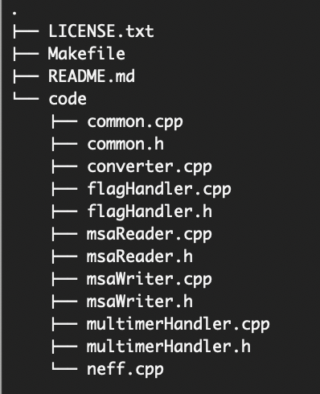

# NEFFy: NEFF Calculator and MSA File Converter
NEFFy is a versatile and efficient tool for bioinformatics research, offering advanced features for calculating NEFF (Normalized Effective Number of Sequences) for Multiple Sequence Alignments (MSA)s of any biological sequences, including protein, RNA, and DNA across various MSA formats. <br>
Additionally, NEFFy includes built-in support for format conversion, allowing users to seamlessly convert between different MSA formats.

## Table of Contents
- [C++ Executable](#cpp-executable)
  - [Installation](#installation)
  - [Project Outline](#project-outline)
  - [Usage](#usage)
    - [NEFF Computation](#1-neff-computation)
    - [MSA File Conversion](#2-msa-file-conversion)
- [Python Library](#python-library)
  - [Library Installation](#library-installation)
  - [Library Usage](#usage)
- [Supported File Formats](#supported-file-formats)
- [Error Handling](#error-handling)
- [License](#license)
- [Citation](#citation)

# C++ Executable

## Installation
To install the NEFFy tool, clone the repository and compile the code using a C++ compiler that supports C++17 or a newer version. You can use the provided [Makefile](Makefile) in the repository for this purpose. Navigate to the repository directory and enter the following command in the terminal:


```
make
```
If the `make` command is not available on your operating system, [here](https://maryam-haghani.github.io/NEFFy/help.html#make_installation) is how you can install it.

Once the compilation is complete, you can run the program via the command line. <br/>
This package is cross-platform and works on Linux, Windows, and macOS without requiring additional compilation. <br>

For more information on installing the executable, please refer to the [documentation](https://maryam-haghani.github.io/NEFFy/installation_guide.html#executable_install).

## Project Outline
The NEFFy repository is structured as follows:




## Usage
### 1. NEFF Computation

NEFF determines the effective number of homologous sequences within a Multiple Sequence Alignment (MSA). It accounts for sequence similarities and provides a measure of sequence diversity. <br/>
To calculate NEFF, use the _neff_ script by providing one or more MSA files and specifying the appropriate flags for NEFF computation. If multiple files are provided, NEFFy will combine them and compute NEFF for the integrated version.


#### Flags:
The code accepts the following command-line flags:
| Flag | Description | Required | Default Value | Example	| 
|------|-------------|----------|---------------|---------|
| `--file=<list of filenames>` | Input files (comma-separated, no spaces) containing multiple sequence alignments | Yes | N/A | `--file=example.fasta` |
| `--format=<list of file formats>` | Input file formats (comma-separated, no spaces) | No | "" | `--format=fasta` |
| `--alphabet=<value>` | Alphabet of MSA <br /> __0__: Protein <br /> __1__: RNA <br /> __2__: DNA | No | 0 | `--alphabet=1` |
| `--check_validation=[true/false]` | Validate the input MSA file based on alphabet or not | No | false | `--check_validation=true` |
| `--threshold=<value>`	| Threshold value of considering two sequences similar (between 0 and 1) | No | 0.8 | `--threshold=0.7` |
| `--norm=<value>` | Normalization option for NEFF <br /> __0__: Normalize by the square root of sequence length <br /> __1__: Normalize by the sequence length <br /> __2__: No Normalization | No | 0 | `--norm=2` |
| `--omit_query_gaps=[true/false]` | Omit gap positions of query sequence from entire sequences for NEFF computation | No | true | `--omit_query_gaps=true`	|
| `--is_symmetric =true/false]` | Consider gaps in number of differences when computing sequence similarity cutoff (asymmetric) or not (symmetric)| No | true | `--is_symmetric=false`	|
| `--non_standard_option=<value>` | Options for handling non-standard letters of the specified alphabet <br /> __0__: Treat them the same as standard letters <br /> __1__: Consider them as gaps when computing similarity cutoff of sequences (only used in asymmetryc version) <br /> __2__: Consider them as gaps in computing similarity cutoff and checking position of match/mismatch | No | 0 | `--non_standard_option=1` |
| `--depth=<value>` | Depth of MSA to be considered in computation (starting from the first sequence) | No | inf (consider all sequences) | `--depth=10` <br />(if given value is greater than original depth, it considers the original depth) |
| `--gap_cutoff=<value>`| Threshold for considering a position as gappy and removing that (between 0 and 1) | No | 1 (no gappy position) | `--gap_cutoff=0.7` |
| `--pos_start=<value>`| Start position of each sequence to be considered in NEFF (inclusive) | No | 1 (the first position) | `--pos_start=10` |
| `--pos_end=<value>`| Last position of each sequence to be considered in NEFF (inclusive) | No | inf (consider all sequence) | `--pos_end=50` (if given value is greater than the length of the MSA sequences, consider length of sequences in the MSA)|
| `--only_weights=[true/false]` | Return only sequence weights, rather than the final NEFF | No | false | `--only_weights=true`    |
| `--multimer_MSA=[true/false]` | Compute NEFF for  MSA of a multimer | No | false | `--multimer_MSA=true`    |
| `--stoichiom=<value>` | Stochiometry of the multimer | when _multimer_MSA_=true |  | `--stoichiom=A2B1`    |
| `--chain_length=<list of values>` | Length of the chains in a heteromer  | when _multimer_MSA_=true and multimer is a heteromer | 0 | `--chain_length=17 45`    |
| `--residue_neff=[true/false]` | Compute per-residue (column-wise) NEFF | No | false | `--residue_neff=true`    |
| `--skip_lines=<value>` | Number of lines to skip at the beginning of the input file. | No | 0 | `--skip_lines=1` |

For more details about features, please refer to the [documentation](https://maryam-haghani.github.io/NEFFy/index.html#overview_neff_computation).

#### Example:
    neff --file=./MSAs/example.a2m --threshold=0.6 --norm=2 --is_symmetric=false --check_validation=true
  As output, it will print the final MSA length, depth and Neff to the console, based on the given options.

For more examples on using NEFFy for NEFF calculations with various options and features, please refer to the documentation [usage guide](https://maryam-haghani.github.io/NEFFy/usage_guide.html#neff_computation).

### 2. MSA File Conversion
The MSA file conversion allows you to convert MSA files between different supported formats. <br/>
All you need is to use the `converter` program and specify the input and output files with their formats, and the tool will perform the conversion accordingly.

#### Flags:
The code accepts the following command-line flags:
| Flag | Description | Required | Default Value | Example	| 
|------|-------------|----------|---------------|---------|
| `--in_file=<filename>` | Specifies the input MSA file to be converted.<br /> Replace `<filename>` with the path and name of the input file | Yes | N/A | `--in_file=input.fasta` |
| `--in_format=<format>` | Specifies the input MSA file format. | No | "" | `--in_format=fasta` |
| `--out_file=<filename>`| Specifies the output file where the converted MSA will be saved.<br /> Replace `<filename>` with the desired path and name of the output file | Yes | N/A | `--out_file=output.a2m` |
| `--out_format=<format>` | Specifies the output MSA file format. | No | "" | `--out_format=a2m` |
| `--alphabet=<value>` | Alphabet of MSA <br /> __0__: Protein <br /> __1__: RNA <br /> __2__: DNA | No | 0 | `--alphabet=1` |
| `--check_validation=[true/false]` | Validate the input MSA file based on alphabet or not | No | true | `--check_validation=true` |

Please note that the conversion is performed based on the specified input and output file extensions. <br>
For more details about features, please refer to the [documentation](https://maryam-haghani.github.io/NEFFy/index.html#overview_converter).

#### Example:
Suppose you have an MSA file named "input.fasta" and you want to convert to the A2M format and save it as "output.a2m".

    converter --in_file=./MSAs/example.a2m --out_file=./MSAs/example.sto

For more examples on using NEFFy for MSA conversion, please refer to the documentation [usage guide](https://maryam-haghani.github.io/NEFFy/usage_guide.html#converter).

<br>


# Python Library

Neffy also provides a python library as an interface of the executable files.

## Library Installation

### From Source

To install the library from the source:

1. Clone the repository:
    ```bash
    git clone https://github.com/Maryam-Haghani/Neffy.git
    ```
2. Navigate to the project directory:
    ```bash
    cd Neffy
    ```
3. Ensure you have `setuptools` and `wheel` installed:
    ```bash
    pip install setuptools wheel
    ```
4. Build the source distribution and wheel:
    ```bash
    python setup.py sdist bdist_wheel
    ```
5. Install the package from the root directory of the project:
    ```bash
    pip install .
    ```

    Alternatively, you can install the package directly from the built wheel file (in the `dist` directory):
    ```bash
    pip install dist/neffy-0.1-py3-none-any.whl
    ```

### From PyPI:
The package is available on [PyPI](https://pypi.org/project/neffy/).
Install the package via pip:

```bash
pip install neffy
```

### From BioConda:
You can also install neffy through [BioConda](https://bioconda.github.io/contributor/guidelines.html) by running the following commands:

```bash
conda config --add channels conda-forge
conda install -c bioconda neffy
```
The first command adds the conda-forge channel to your Conda configuration, which is necessary to access a broader range of packages and dependencies that might not be available on the default channels.

## Library Usage
### An example of neff computation:
```bash
cd example
python compute_neff.py
```

You can find more examples of using the Python library's various methods for NEFF calculations in the examples directory. For method parameters and detailed explanations, please refer to the documentation [usage guide](https://maryam-haghani.github.io/NEFFy/usage_guide.html#python_neff_main).


### An example of MSA conversion:
```bash
cd example
python convert_msa.py
```

Additional examples of using NEFFy for MSA conversion can be found in the example directory. For further detailed explanations, please refer to the documentation [usage guide](https://maryam-haghani.github.io/NEFFy/usage_guide.html#python_converter).

<br>

# Supported File Formats
- __A2M__ (aligned FASTA-like format)
- __A3M__ (compressed aligned FASTA-like format with lowercase letters for insertions)
- __FASTA__, __AFA__, __FAS__, __FST__, __FSA__ (FASTA format)
- __STO__ (Stockholm format)
- __CLUSTAL__ (CLUSTAL format)
- __ALN__ (ALN format)
- __PFAM__ (format mostly used for nucleotides)

In the [documentation](https://maryam-haghani.github.io/NEFFy/msa_formats.html), you will find a brief explanation of each format, along with an illustrative alignment example for each one.

<br>

# Error Handling
If any errors occur during the execution of the MSA Processor, an error message will be displayed, describing the issue encountered. <br/>
Please refer to the error message for troubleshooting or make necessary corrections to the input.

# License
This project is licensed under the GNU General Public License v3.0 - see the [LICENSE](LICENSE.txt) file for details.

# Citation

If you use **NEFFy** in your research, please cite the following:

Maryam Haghani, Debswapna Bhattacharya, T M Murali, NEFFy: A Versatile Tool for Computing the Number of Effective Sequences, Bioinformatics, 2025; [https://doi.org/10.1093/bioinformatics/btaf222](https://doi.org/10.1093/bioinformatics/btaf222)

## Archival DOI  

For long-term accessibility and reproducibility, each release of **NEFFy** is archived with a DOI:
| Version  | DOI |
|----------|-------------------------------------------|
| **Latest (v0.1.1)** | 🔗 [Zenodo DOI: 10.5281/zenodo.14908220](https://doi.org/10.5281/zenodo.14908219) |
----------------
For further assistance, please see the [documentation](https://maryam-haghani.github.io/NEFFy/).
